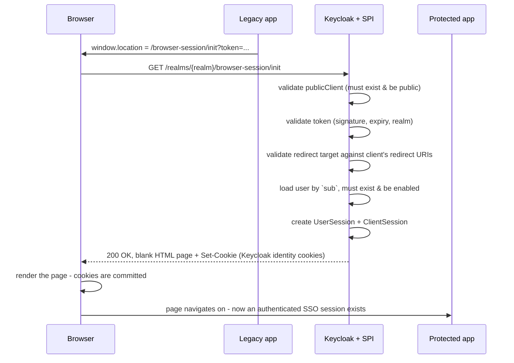

# keycloak-spi-browser-session-api


A [Keycloak](https://www.keycloak.org/) [SPI](https://www.keycloak.org/docs/latest/server_development/index.html#_providers)
that turns a valid access token (JWT) into a **real browser session**: it creates a user
session in Keycloak, sets Keycloak's identity cookies and redirects the browser back to
your application.

Useful to bridge SSO from a legacy web application - which already holds a token but has
never performed an interactive login in this browser - to a new application that is
protected by Keycloak (e.g. via [keycloak-js](https://www.npmjs.com/package/keycloak-js)).

> **Prerequisite:** the legacy application must be able to obtain a valid access token for
> the realm. Without it there is nothing to convert.

## Table of contents

- [How it works](#how-it-works)
- [Compatibility](#compatibility)
- [Build](#build)
- [Deployment](#deployment)
- [Configuration](#configuration)
- [Reverse proxy and issuer consistency](#reverse-proxy-and-issuer-consistency)
- [API](#api)
- [Usage](#usage)
- [Security considerations](#security-considerations)
- [Local demo](#local-demo)
- [Troubleshooting](#troubleshooting)
- [License](#license)

## How it works

The endpoint is entered by a **top level browser navigation**. The application sends the
browser to the SPI, the SPI creates the session and sets the cookies, and then redirects
the browser back:

```
application  --(302, ?token=...)-->  SPI  --(200 blank page + Set-Cookie)-->  application
```

The last hop is deliberately **not** a bare `302`. A redirect is a response the browser
consumes internally - nothing is ever painted, and a prefetching browser, an intermediary
or a privacy mode that treats the hop as a tracking redirect can drop the cookies on the
way. Instead the SPI answers with a real, empty HTML document that carries the
`Set-Cookie` headers; the browser commits that page as the current top level document -
so the cookies are stored - and only then the page navigates on to the application
(`location.replace`, with a `meta refresh` as the no-JavaScript fallback). See
[Configuration](#configuration) for `BSAPI_INTERSTITIAL` and `BSAPI_INTERSTITIAL_DELAY_MS`.



Step by step, as implemented in
[`BrowserSessionRestProvider`](src/main/java/com/contabo/keycloak/spi/realmresourceprovider/browseresssion/BrowserSessionRestProvider.java):

1. `publicClient` is looked up in the realm and must exist **and be a public client**.
2. The token is validated (signature, expiry, realm) via `Tokens.getAccessToken`.
3. The redirect target is resolved and validated **before** any state is created, so a bad
   request never leaves a dangling user session behind.
4. The user is loaded by the token's `sub` claim and must exist and be enabled.
5. A `UserSessionModel` (auth method `KEYCLOAK`, persistent, remember-me off) and a client
   session for `publicClient` are created.
6. `AuthenticationManager.createLoginCookie` sets Keycloak's identity cookies.
7. The response is `200 OK` with a blank HTML page that carries those cookies and then
   sends the browser to the redirect target itself. It is served `no-store` and with
   `Referrer-Policy: no-referrer` plus a matching `<meta name="referrer">`, so the token
   bearing URL of this page never reaches the application as a `Referer`.
   Set `BSAPI_INTERSTITIAL=false` for the previous `302 Found` behaviour.

## Compatibility

| SPI version | Keycloak      | Distribution | Java | JAX-RS namespace |
|-------------|---------------|--------------|------|------------------|
| 3.0         | 26.x          | Quarkus      | 17+  | `jakarta.ws.rs`  |
| 2.0         | 21.x          | Quarkus      | 11+  | `javax.ws.rs`    |
| 1.0         | 14.x (legacy) | WildFly      | 8    | `javax.ws.rs`    |

Version 3.0 is built and verified against **Keycloak 26.7.3**. Upgrading from 2.0 required
three changes on the Keycloak side, none of which are backwards compatible:

* **Keycloak 22** migrated from `javax.*` to the **Jakarta EE namespace**, so all JAX-RS
  imports are now `jakarta.ws.rs.*`.
* **Keycloak 25** replaced RESTEasy Classic with **RESTEasy Reactive**, which moved the
  `@NoCache` annotation from `org.jboss.resteasy.annotations.cache` to
  `org.jboss.resteasy.reactive`. It now comes from
  `io.quarkus.resteasy.reactive:resteasy-reactive-common`.
* **Keycloak 26** moved `org.keycloak.services.resource.RealmResourceProvider` out of
  `keycloak-services` into **`keycloak-server-spi-private`**. The package name is
  unchanged, so only the dependency in [pom.xml](pom.xml) is affected.

A 3.0 jar therefore does **not** load on Keycloak 21 or older, and a 2.0 jar does not load
on Keycloak 22 or newer.

Keycloak 26 supports OpenJDK 17, 21 and 25; the official container image runs OpenJDK 21.
The jar is compiled to **Java 17 bytecode**, the lowest supported version, so it loads on
all three. Do not raise `java.version` in [pom.xml](pom.xml) above the Java version your
Keycloak server actually runs on - a newer build fails with `UnsupportedClassVersionError`.
Check with `docker exec <container> java -version`.

> Note that OpenJDK 17 support is **deprecated** in Keycloak 26 and will be removed in a
> later release. Once your servers are on 21 or newer you may raise `java.version` to `21`.

Keycloak 17+ no longer serves its endpoints under the `/auth` prefix, so the path is
`/realms/...` and not `/auth/realms/...`. If you run the server with
`--http-relative-path=/auth` for backwards compatibility, keep the old prefix.

## Build

```sh
mvn clean package
```

Produces `target/keycloak-spi-browser-session-api-3.0.jar`. All Keycloak and RESTEasy
dependencies are `provided` - the jar contains only the two SPI classes and the
`META-INF/services` registration.

To build against a different Keycloak release, override the version property:

```sh
mvn clean package -Dkeycloak.version=26.6.4
```

Within Keycloak 26 that is usually enough. Note that `quarkus.version` in
[pom.xml](pom.xml) only supplies the `@NoCache` annotation and is pinned to the Quarkus
version of the targeted Keycloak release (see `<quarkus.version>` in that release's
`keycloak-parent` pom).

## Deployment

The Quarkus based distribution (Keycloak 17+) has no `deployments` folder any more.
Providers are placed in `providers` and the server has to be re-augmented once:

1. Build with `mvn clean package`
2. Copy `target/keycloak-spi-browser-session-api-3.0.jar` to `/opt/keycloak/providers/`
3. Run `/opt/keycloak/bin/kc.sh build`
4. Start Keycloak

When building a container image, do all of that at image build time - see
[Dockerfile.keycloak](Dockerfile.keycloak):

```dockerfile
COPY target/keycloak-spi-browser-session-api-*.jar /opt/keycloak/providers/
RUN /opt/keycloak/bin/kc.sh build
```

`kc.sh start-dev` re-augments automatically, so for local development dropping the jar into
`providers` and restarting is enough.

> The [Dockerfile](Dockerfile) in the repository root only ships the built jar into an
> internal base image and is not needed to run the SPI.

## Configuration

The SPI itself has no provider configuration. Everything is driven by the request
parameters and by Keycloak's own client settings.

| What | Where |
|------|-------|
| Realm | path element of the endpoint URL |
| User | taken from the `sub` claim of the token |
| Target client | `publicClient` query parameter - must be a **public** client in that realm |
| Allowed redirect targets | `Valid redirect URIs` of `publicClient` |
| CORS origin (preflight only) | `Web origins` of `publicClient` |

The environment variables are:

| Variable | Default | Description |
|----------|---------|-------------|
| `BSAPI_ACCESS_CONTROL_ALLOW_HEADERS` | `origin, content-type, accept, authorization` | Overrides `Access-Control-Allow-Headers` on the `OPTIONS` preflight response |
| `BSAPI_INTERSTITIAL` | `true` | Whether to hand the browser a blank HTML page that carries the cookies and then navigates on. `false` answers with a plain `302 Found` instead |
| `BSAPI_INTERSTITIAL_DELAY_MS` | `0` | How long that page stays on screen before it navigates on, in milliseconds (capped at `10000`). `0` still renders the page, it just leaves again as soon as it is there |

Note that the redirect target is validated against the `Valid redirect URIs` of
`publicClient` using the same check Keycloak applies to OIDC redirects (wildcards
supported). **The URL you want to come back to has to be listed on that client**, even when
the returning page belongs to a different application.

## Reverse proxy and issuer consistency

This is by far the most common reason for *"the redirect happens but no cookies appear"*,
and the behaviour changed between the old WildFly era releases and Keycloak 26.

Keycloak derives the realm URL from the **incoming request** and uses it for two things:

* the `iss` claim it requires on the access token you pass in, and
* the `iss` baked into the identity cookie, which is verified again on every later request
  (`TokenVerifier ... .realmUrl(Urls.realmIssuer(uriInfo.getBaseUri(), realm.getName()))`).

If those URLs disagree the token is rejected with `401 invalid_token` and **no cookies are
set at all**. Two rules follow:

1. **Fetch the token through the same public URL the browser uses.** A token obtained
   server-to-server from `http://keycloak:8080` carries `iss: http://keycloak:8080/realms/{realm}`
   and will never validate on `https://keycloak.example.org`.
2. **Tell Keycloak its public address.** Keycloak 26 ignores `X-Forwarded-*` unless
   `proxy-headers` is set explicitly - unset, it resolves everything to the internal address.

```sh
KC_HOSTNAME=https://keycloak.example.org
KC_PROXY_HEADERS=xforwarded     # or `forwarded`, matching your proxy
KC_HTTP_ENABLED=true            # when the proxy speaks plain http to Keycloak
```

and on the proxy (nginx):

```nginx
proxy_set_header Host              $host;
proxy_set_header X-Forwarded-Proto $scheme;
proxy_set_header X-Forwarded-Host  $host;
```

Keycloak 11 derived the cookie's `Secure` flag from the realm's *Require SSL* setting
(`realm.getSslRequired().isRequired(connection)`). Keycloak 26 derives it from the scheme of
the request as the server sees it (`SecureContextResolver.isSecureContext`), so a
misconfigured proxy now changes the cookie attributes too.

To see what the endpoint actually returns:

```sh
curl -si "https://keycloak.example.org/realms/{realm}/browser-session/init\
?publicClient=app&token=$TOKEN&redirect_uri=https%3A%2F%2Fapp.example.org%2F" | head -20
```

`200` plus two `Set-Cookie` headers is success - the HTML body is the blank page that
carries the browser on to `redirect_uri`. `401` means the token was rejected - the error
description names both issuers when they differ.

## API

| Method    | Path                                             | Description |
|-----------|--------------------------------------------------|-------------|
| `GET`     | `{baseUrl}/realms/{realm}/browser-session/init`   | Creates the browser session, answers `200 OK` with the session cookies and a blank page that redirects on |
| `OPTIONS` | `{baseUrl}/realms/{realm}/browser-session/init`   | CORS preflight, kept for the legacy XHR flow |

### Query parameters

| Parameter      | Required | Description |
|----------------|----------|-------------|
| `publicClient` | yes      | public client (defined in Keycloak) for which to start the browser session |
| `token`        | yes\*    | the access token (JWT). \*An `Authorization: Bearer` header is accepted as a fallback |
| `redirect_uri` | no       | **absolute** URL to redirect back to. Falls back to the `Referer` header. Must match the `Valid redirect URIs` of `publicClient` |

Do not URL-encode `redirect_uri` more than once: the value is handed back as supplied, and
a still-encoded, non absolute string is rejected rather than turned into a broken redirect.

The `Referer` fallback is unreliable - under the default
`Referrer-Policy: strict-origin-when-cross-origin` browsers send only the bare origin on
cross-origin navigations, and nothing at all on an `https` -> `http` downgrade. Pass
`redirect_uri` explicitly.

### Responses

| Status             | `error`                | When |
|--------------------|------------------------|------|
| `200 OK`           | -                      | success - blank HTML page, cookies are set, the page navigates to the redirect target (`302 Found` with a `Location` header when `BSAPI_INTERSTITIAL=false`) |
| `400 Bad Request`  | `client_not_found`     | `publicClient` is unknown or is not a public client |
| `400 Bad Request`  | `invalid_redirect_uri` | no `redirect_uri` and no `Referer` to fall back to; target not listed on the client; target not an absolute URL |
| `401 Unauthorized` | `invalid_token`        | no token given, malformed `Authorization` header, or invalid/expired token |
| `401 Unauthorized` | `user_not_found`       | the token's subject is unknown in the realm or the user is disabled |

Errors are returned as Keycloak's standard OAuth error body:

```json
{ "error": "invalid_redirect_uri", "error_description": "..." }
```

### CORS

Only the `OPTIONS` preflight emits CORS headers. The allowed origin is derived from the
`Referer` header and matched against the `Web origins` of `publicClient`; a configured `*`
echoes the request origin back, because `*` is not allowed together with
`Access-Control-Allow-Credentials: true`.

The `GET` response carries **no** CORS headers, so it cannot be consumed by a cross-origin
`fetch`/`XHR` - use the top level navigation described below.

## Usage

Prerequisite is a valid access token obtained from your Keycloak IDM.

```javascript
// config
var providerUrl = "https://your.keycloak.example.org";
var realm = "master";
var targetClientForNewSession = "application";
var jwt = "eyJhbGciOiJSUzI1NiIs.....";
var redirectUri = window.location.href; // where to come back to

// invocation - top level navigation, the SPI redirects back here
window.location.href = `${providerUrl}/realms/${realm}/browser-session/init`
  + `?publicClient=${encodeURIComponent(targetClientForNewSession)}`
  + `&token=${encodeURIComponent(jwt)}`
  + `&redirect_uri=${encodeURIComponent(redirectUri)}`;
```

## Security considerations

This endpoint mints a browser session out of a bearer token. Read this section before
deploying it.

* **The token travels in the URL.** A browser redirect cannot carry an `Authorization`
  header, so the token lands in the browser history, in the Keycloak access log and in the
  logs of every reverse proxy in front of it. Use short lived access tokens.
* **HTTPS is required.** Keycloak sets its identity cookies with `SameSite=None`, which
  forces the `Secure` attribute. Browsers therefore drop those cookies over plain `http://`
  everywhere except `localhost`.
* **The token is not bound to `publicClient`.** Validation covers signature, expiry and
  realm - not the `azp`/`aud` claims. Any valid access token of the realm can therefore be
  exchanged for a browser session on any public client of that realm. Treat every token in
  the realm as equally powerful, and only expose this endpoint where that is acceptable.
* **No open redirect.** The redirect target is verified against the client's
  `Valid redirect URIs`, so the endpoint cannot be used to bounce users to arbitrary URLs.
* **The new session is independent.** It is not linked to the session the original token
  came from, so logging out on the legacy side does not terminate it. Its lifetime follows
  the realm's SSO session settings.
* **No re-authentication happens.** Anyone able to read a token - from a log, a shared
  screen, a copied URL - can obtain a full browser session with it until it expires.

## Local demo

Starts Keycloak 26 with PostgreSQL plus two static demo apps. The `keycloak` service is
built from [Dockerfile.keycloak](Dockerfile.keycloak) and bakes in the jar from `target`,
so build the SPI first:

```sh
mvn clean package
docker compose up --build
```

| Service | URL | Role |
|---------|-----|------|
| Keycloak | <http://localhost:5080> | IDM, `admin` / `admin` |
| `start-app` | <http://localhost:5082> | starting point - holds a JWT, no authentication of its own |
| `dest-app` | <http://localhost:5081> | demo site secured with `keycloak-js` |

The goal is to initiate a browser session for `dest-app` from `start-app`, having nothing
but a valid JWT.

> The admin user is created from `KC_BOOTSTRAP_ADMIN_USERNAME` / `KC_BOOTSTRAP_ADMIN_PASSWORD`.
> Keycloak 26 deprecated the previous `KEYCLOAK_ADMIN` / `KEYCLOAK_ADMIN_PASSWORD` names.
>
> [`dest-app`](demo/dest-app/index.html) loads `keycloak-js` from a CDN as an ES module.
> Keycloak 26 no longer serves the adapter from `/js/keycloak.js` - it is a standalone,
> ESM-only npm package now.

### Configure Keycloak

Log in at <http://localhost:5080/> (`admin` / `admin`) and create:

* client `dest-app` - `Client authentication` **off** (public)
  * `Valid redirect URIs`: `http://localhost:5081/*` **and** `http://localhost:5082/*`
    (the demo returns to `start-app`, and the redirect target is checked against this
    client)
  * `Web origins`: `http://localhost:5082` and/or `*`
* client `private` - `Client authentication` **on** (confidential), `Direct access grants`
  enabled
* user `testuser` with password `Test123!`, `Email verified` on and no required actions, so
  the password grant succeeds

### Run it

Generate an access token and place it into [demo/start-app/index.html](demo/start-app/index.html).
This is for demo purposes only - never hardcode tokens in a real application.

```sh
CLIENT_ID=private
# change CLIENT_SECRET accordingly - it is generated by Keycloak
CLIENT_SECRET=8b3576db-6492-4238-aa60-d7c71a9663f7
API_USER=testuser
API_PASSWORD='Test123!'

ACCESS_TOKEN=$(curl -s \
  -d "client_id=$CLIENT_ID" \
  -d "client_secret=$CLIENT_SECRET" \
  --data-urlencode "username=$API_USER" \
  --data-urlencode "password=$API_PASSWORD" \
  -d 'grant_type=password' \
  'http://localhost:5080/realms/master/protocol/openid-connect/token' | jq -r '.access_token')

sed -i -E 's#var jwt = ".*$#var jwt = "'"$ACCESS_TOKEN"'";#' demo/start-app/index.html
```

Reload <http://localhost:5082>, click *Init Browser Session*, then *Open dest-app* - it
should come up authenticated without a login form.

After rebuilding the SPI, rebuild and restart the Keycloak container so that `kc.sh build`
picks up the new jar:

```sh
mvn clean package && docker compose up -d --build keycloak
```

## Troubleshooting

| Symptom | Cause |
|---------|-------|
| `404` on `/realms/{realm}/browser-session/init` | jar not in `providers/`, or `kc.sh build` was not re-run after adding it. Check *Realm settings -> Provider info* in the admin console |
| `UnsupportedClassVersionError` on startup | jar compiled for a newer Java than the server runs. Lower `java.version` in [pom.xml](pom.xml) |
| `NoClassDefFoundError: javax/ws/rs/...` or `ClassNotFoundException` for `org.jboss.resteasy.annotations.cache.NoCache` | a 2.0 (Keycloak 21) jar deployed on Keycloak 22+. Rebuild with this 3.0 version |
| `NoClassDefFoundError: jakarta/ws/rs/...` | a 3.0 jar deployed on Keycloak 21 or older. Use the 2.0 branch there |
| Redirect works but the user is still not logged in | cookies were dropped - identity cookies are `Secure`, so plain `http://` only works on `localhost` |
| `400 invalid_redirect_uri` | the return URL is not listed in `Valid redirect URIs` of `publicClient`, or it was encoded twice and is no longer absolute |
| `400 client_not_found` | `publicClient` does not exist in that realm, or `Client authentication` is on (confidential client) |
| `401 invalid_token` | token expired, signed by another realm, or not passed at all |
| `401 invalid_token` and no cookies at all | issuer mismatch - the token was minted through a different Keycloak URL than the one the browser hits. See [Reverse proxy and issuer consistency](#reverse-proxy-and-issuer-consistency) |
| Cookies are set but the user is still anonymous later | the identity cookie's `iss` no longer matches the realm URL, usually an unstable `hostname` / `proxy-headers` setup |
| `404` on `/js/keycloak.js` | Keycloak 26 no longer ships the JS adapter. Install [`keycloak-js`](https://www.npmjs.com/package/keycloak-js) from npm or load it from a CDN |
| Admin user is not created in the demo | Keycloak 26 renamed the variables to `KC_BOOTSTRAP_ADMIN_USERNAME` / `KC_BOOTSTRAP_ADMIN_PASSWORD` |
| Old `/auth/realms/...` URL returns `404` | Keycloak 17+ dropped the `/auth` prefix unless started with `--http-relative-path=/auth` |

## License

[Apache License, Version 2.0](LICENSE)
